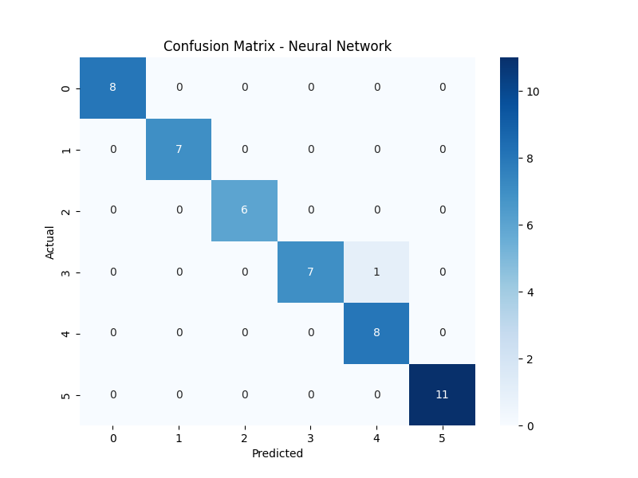
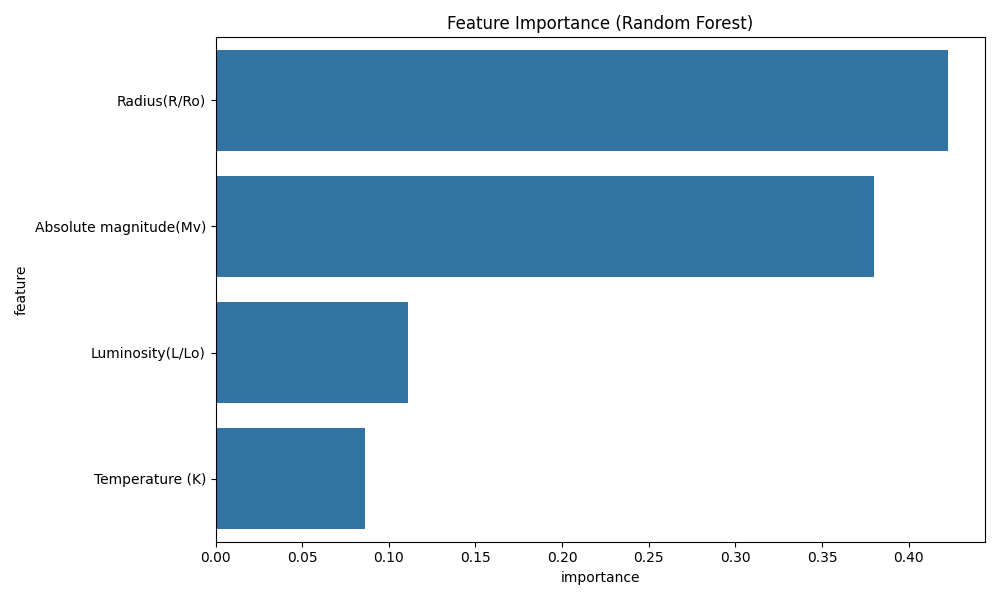

# StarSort

## Overview
StarSort is a Python-based machine learning project that classifies stars into distinct types based on their physical attributes. By leveraging multiple algorithms—such as Naive Bayes, Random Forest, SVM, Neural Network, and Decision Tree—StarSort provides a comprehensive analysis of classification performance and visualization of results. This project is ideal for exploring machine learning techniques in astrophysics data.

## Features
- **Multi-Model Classification**: Classifies stars using five machine learning models, with performance comparisons.
- **Data Preprocessing and Feature Scaling**: Scales and preps data for model accuracy.
- **Cross-Validation and Performance Analysis**: Compares model accuracies and cross-validation scores.
- **Feature Importance Analysis**: Highlights significant features impacting classification (Random Forest).
- **Confusion Matrix Visualization**: Provides detailed confusion matrices for each model to evaluate classification across all star types.
- **Comprehensive Classification Report**: Outputs precision, recall, and F1-scores for each star type, providing insights into model performance on each class.

## Dataset
The dataset used, `Stars.csv` (from https://www.kaggle.com/datasets/deepu1109/star-dataset), includes various features such as:
- **Temperature (K)**
- **Luminosity (L/Lo)**
- **Radius (R/Ro)**
- **Absolute Magnitude (Mv)**
- **Star Type** (target variable)

Each row in the dataset corresponds to an individual star with values for the attributes listed above.

## Model Performance
The following models were evaluated for classification accuracy and overall performance on all star types:

- **Naive Bayes**
- **Random Forest**
- **Support Vector Machine (SVM)**
- **Neural Network**
- **Decision Tree**

Each model's performance was assessed using precision, recall, and F1-scores to provide a comprehensive evaluation of classification accuracy across all star types. Below are the key metric definitions:

- **Precision**: Measures the model's ability to avoid false positives for each star type.
- **Recall**: Reflects each model’s effectiveness in identifying all true instances of each star type.
- **F1-Score**: Balances precision and recall, providing a single metric for overall performance.

The confusion matrices and classification reports for each model reveal detailed insights into how effectively each model differentiates between the various star types.

## Performance Metrics Results
The performance metrics for each model are as follows:

### Naive Bayes Results:
- **Accuracy**: 96%

| Class | Precision | Recall | F1-Score | Support |
|-------|-----------|--------|----------|---------|
| 0     | 0.89      | 1.00   | 0.94     | 8       |
| 1     | 1.00      | 0.86   | 0.92     | 7       |
| 2     | 1.00      | 1.00   | 1.00     | 6       |
| 3     | 1.00      | 0.88   | 0.93     | 8       |
| 4     | 0.89      | 1.00   | 0.94     | 8       |
| 5     | 1.00      | 1.00   | 1.00     | 11      |

### Random Forest Results:
- **Accuracy**: 100%

| Class | Precision | Recall | F1-Score | Support |
|-------|-----------|--------|----------|---------|
| 0     | 1.00      | 1.00   | 1.00     | 8       |
| 1     | 1.00      | 1.00   | 1.00     | 7       |
| 2     | 1.00      | 1.00   | 1.00     | 6       |
| 3     | 1.00      | 1.00   | 1.00     | 8       |
| 4     | 1.00      | 1.00   | 1.00     | 8       |
| 5     | 1.00      | 1.00   | 1.00     | 11      |

### SVM Results:
- **Accuracy**: 96%

| Class | Precision | Recall | F1-Score | Support |
|-------|-----------|--------|----------|---------|
| 0     | 0.89      | 1.00   | 0.94     | 8       |
| 1     | 1.00      | 0.86   | 0.92     | 7       |
| 2     | 1.00      | 1.00   | 1.00     | 6       |
| 3     | 1.00      | 0.88   | 0.93     | 8       |
| 4     | 0.89      | 1.00   | 0.94     | 8       |
| 5     | 1.00      | 1.00   | 1.00     | 11      |

### Neural Network Results:
- **Accuracy**: 98%

| Class | Precision | Recall | F1-Score | Support |
|-------|-----------|--------|----------|---------|
| 0     | 1.00      | 1.00   | 1.00     | 8       |
| 1     | 1.00      | 1.00   | 1.00     | 7       |
| 2     | 1.00      | 1.00   | 1.00     | 6       |
| 3     | 1.00      | 0.88   | 0.93     | 8       |
| 4     | 0.89      | 1.00   | 0.94     | 8       |
| 5     | 1.00      | 1.00   | 1.00     | 11      |

### Decision Tree Results:
- **Accuracy**: 100%

| Class | Precision | Recall | F1-Score | Support |
|-------|-----------|--------|----------|---------|
| 0     | 1.00      | 1.00   | 1.00     | 8       |
| 1     | 1.00      | 1.00   | 1.00     | 7       |
| 2     | 1.00      | 1.00   | 1.00     | 6       |
| 3     | 1.00      | 1.00   | 1.00     | 8       |
| 4     | 1.00      | 1.00   | 1.00     | 8       |
| 5     | 1.00      | 1.00   | 1.00     | 11      |

## Visualizations
The project includes the following visualizations to aid in understanding model performance and feature importance.

- **Confusion Matrices**:

- **Accuracy and Cross-Validation Comparison**:

- **Feature Importance**:

## Results
StarSort successfully achieved high classification accuracy across all models when evaluated on all star types. Here is a summary of each model's performance:

- **Random Forest**: 100% accuracy
- **Decision Tree**: 100% accuracy
- **Neural Network**: 98% accuracy
- **Naive Bayes**: 96% accuracy
- **Support Vector Machine (SVM)**: 96% accuracy

### Conclusion
Both Random Forest and Decision Tree models performed with perfect accuracy on this dataset, making them the best choices for reliable star classification. Neural Network, SVM, and Naive Bayes also performed well, but with slight misclassifications, highlighting the effectiveness of ensemble models for this project.
